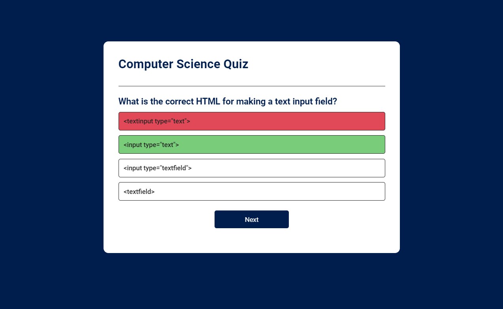

# Computer Science Quiz App

## Overview
The Computer Science Quiz App is a web application that offers a dynamic quiz experience for testing your knowledge in computer science. With a diverse range of questions sourced from APIs, users can assess their proficiency across various topics in the field of computer science.

## try and test your Computer Science skills & knowledge
(https://computersciencequizapp.netlify.app/)

## Features
- Dynamic quiz questions sourced from APIs
- Immediate feedback on answers
- Score tracking
- Option to reset the quiz

## Screenshot



## Technologies Used
- HTML
- CSS
- JavaScript

## APIs
- [QuizAPI](https://quizapi.io/): To use the QuizAPI, sign up for an account and obtain an API key.

## Usage
1. Clone the repository:
   ```bash
   git clone https://github.com/Abhijais2003/Computer-Science-Quiz-App.git
   ```
2. Navigate to the project directory:
   ```bash
   cd Computer-Science-Quiz-App
   ```
3. Open the `script.js` file and replace `YOUR_API_KEY` with your QuizAPI key.
4. Open the `index.html` file in your web browser to start the quiz.

## How to Contribute
Contributions are welcome! Feel free to submit pull requests or open issues.

## License
This project is licensed under the MIT License.
